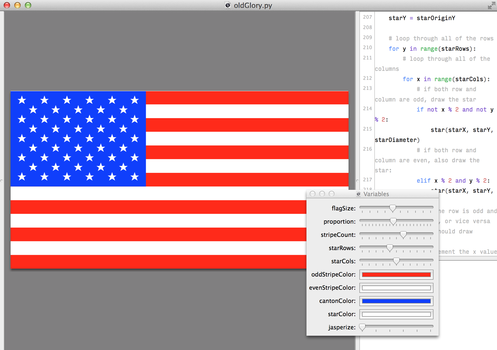

OldGlory
========

Using <a href="http://drawbot.readthedocs.org">Drawbot</a> to draw the American flag. 

But it's also responsive! I made it to experiment with Drawbot Variables.

For the most part, it follows the rules here:    
    http://en.wikipedia.org/wiki/Flag_of_the_United_States#Specifications
    
It does make some small allowances in order to get better results when the
variables are customized.

Wouldn't it be cool if the stars followed the historical patterns, starting with the ring of 13? Maybe next time.
